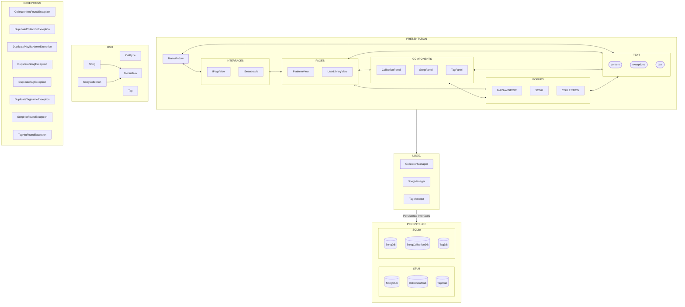

# OVERVIEW

BeatBinder Limited™ (BBL™) is a music library management system. It follows a 3-tier architecture style with stub persistence for data access and Domain Specific Objects (DSO) for core entities.

## PACKAGES AND RESPONSIBILITIES

- exceptions: Contains specific exceptions used to prevent unwanted behaviour and give specific error messages.
- logic: Moves data from presentation to persistence and vice versa while making decisions that preserve the integrity of both sides.
- objects: Contains core domain entities such as Song, SongCollection, and MediaItem.
- persistence: Contains the files needed to set up our persistent objects as well as their associated interfaces.
- persistence.stub: Contains in-memory ("stub") implementations of data access classes like UserSongStub and PlatformCollectionStub.
- persistence.sqlite: Contains an SQLite database for persistent information storage between sessions.
- presentation: Contains files responsible for displaying information to users.
- presentation.components: Contains segregated panels that display specific information modularly.
- presentation.pages: Contains the main pages of the program that the user can switch between.
- presentation.popups: Contains extra popups that are shown to the user.
- presentation.text: Contains all non-dynamic text displayed in the program, as well as files to retrieves the text from their xml files.

## CORE COMPONENTS

- MainWindow: Starts the UI and delegates its continued operation to other classes.
- PlatformView: Displays songs and albums preloaded on the system.
- UserLibraryView: Displays liked songs and albums, and custom playlists created by the user.
- SongManager: Handles communication between the logic layer and the song persistence stubs.
- CollectionManager: Handles communication between the logic layer and the SongCollection persistence stubs.
- TagManger: Mediates between logic and tag persistence.
- Song: Represents a song, contains all relevant data. Do not know which collections they are apart of.
- SongCollection: Represents a collection of songs like a playlist or album. Has no knowledge of the songs it contains.
- Tag: Represents a tag which can be applied to songs to personalise their arrangement.

# DIAGRAM
The following diagram has been abstracted to the package level. Presentation is so complicated
and intertwined that building the diagram at the class level would be entirely unreadable, so we
have chosen this approach to convey our information.

