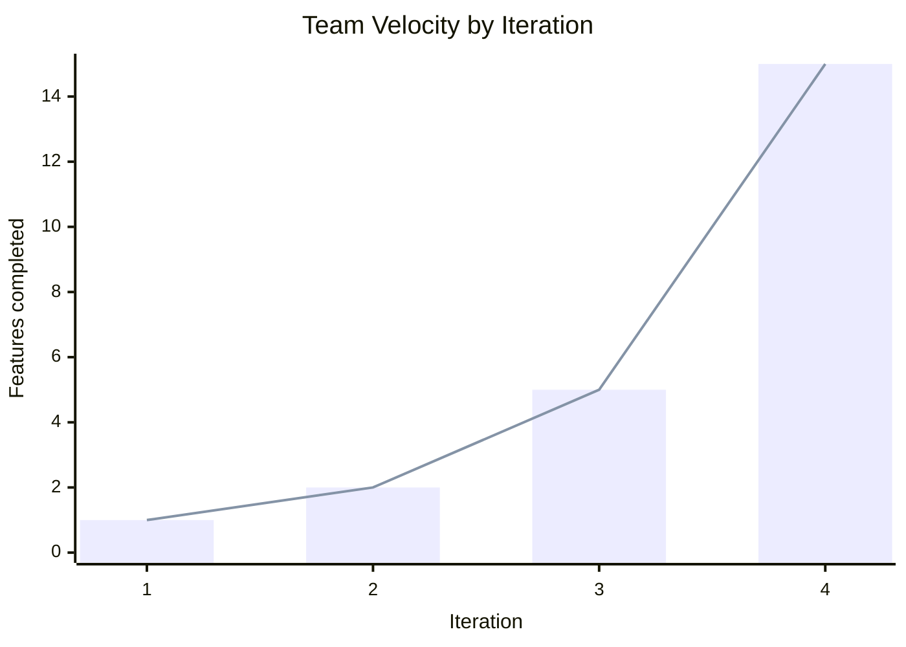
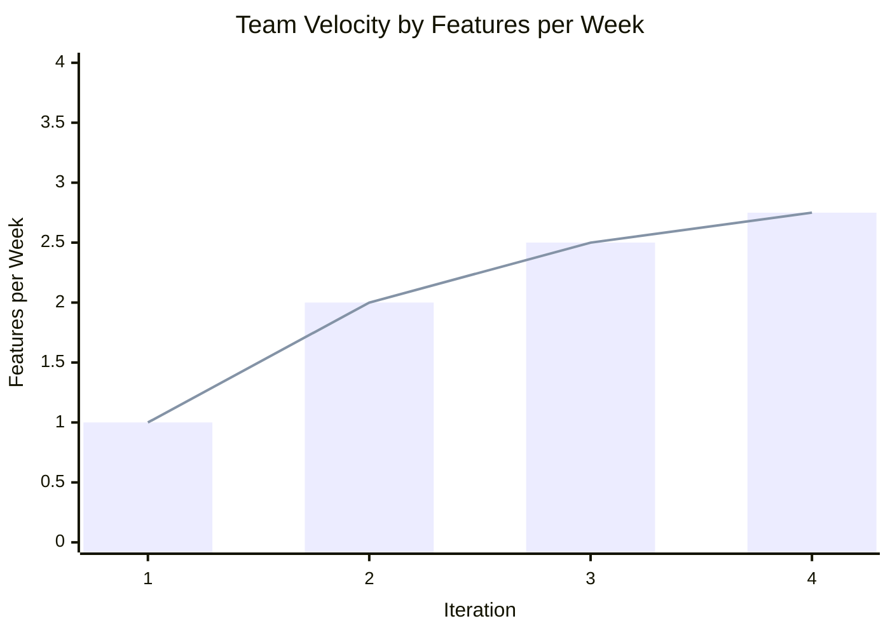

# Iteration 2 Retrospective

When the iteration 2 deadline arrived, our SQLite database was not fully functional and the UI was
questionable. We decided to ship I2 using the stub database due to it being fully functional, but
the lack of persistence severely hampered our grade, and having to ship such a half-finished
product damaged morale. The largest contributors to this failure were:

## The Bad

### Technical Debt
After iteration 1, we realised that in their current forms, stub and SQLite would
work completely differently, making them extremely counterintuitive to work with a develop. Not
only this, but our DSO design was tailored to stub and would pose a challenge when the time came
for the SQLite to interact with them. Refactoring stub to emulate the real database took a
significant amount of time and group resources which lowered the amount of work we could put into
new iteration 2 features. And while rebuilding the objects was not a large endeavour due to the 
small number of them, they had to be redesigned from the ground up to be more intuitive on all
fronts which pulled resources from other areas.

### Spinning wheels
There was a pause after iteration 1 where we stopped to catch our breath, which
pushed our progress back significantly. This lead to a very stressful situation where presentation
development started on Monday and by Wednesday morning we didn't have a functional product. This
has led multiple group members to feel they didn't pull their weight this iteration. Frankly, it's
a miracle we handed in what we did.

### Improvements
We immediately recognised what had gone wrong with I2. After the deadline, we quickly launched
into iteration 3, no doubt pushed by a concerned email from a certain prof. Tests were written,
features were pushed, and we believe that we are in a solid position with the I3 deadline drawing 
near. The spinning wheels were averted, and having paid off our technical debt during I2, very
little refactoring was necessary, freeing up resources to complete features that were pushed
to this iteration.

## The Good

### Success
Coming out of I2, we thought we could consider ourselves successful if the database matched the
functionality of stub. But now, near the end of the iteration, having seen the speed, consistency,
and reliability of our team, success means finishing every feature we outlined in I0. We expect
all features to experience minimal bugs, providing a smooth and reliable experience, with
comprehensive testing ensuring quality across the board. We expect identical behaviour from stub
and SQLite, and at least 80% testing in all areas.

### Final Thoughts
Throughout this course, communication between members has been continuously phenomenal. Any
questions were answered quickly, meetings were held regularly, and assigning tasks was never an
issue. Members were vocal during meetings offering ideas and suggestions, and various members
stepped up when others struggled. It has been a pleasure to work with this team.

# Team Velocity
Iterations 3 and 4 are projected.

